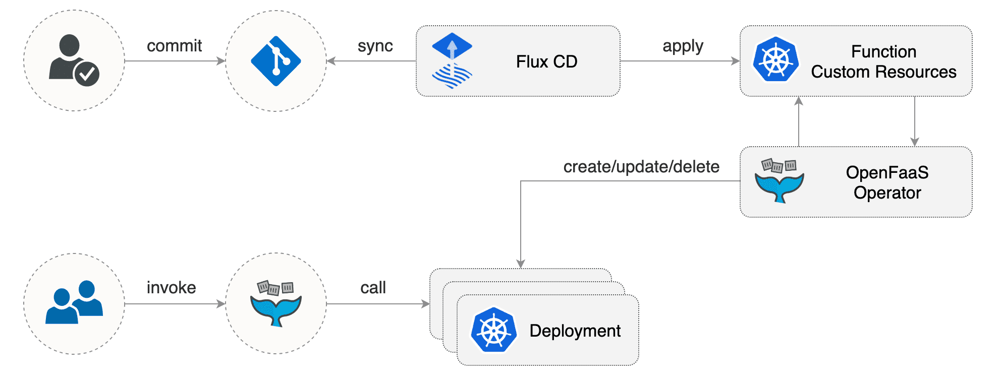
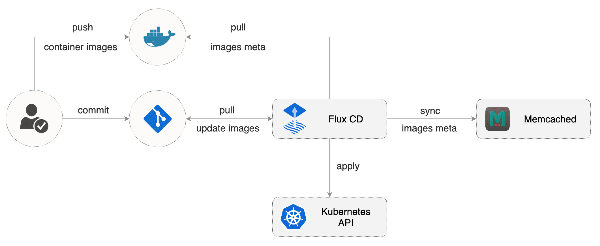
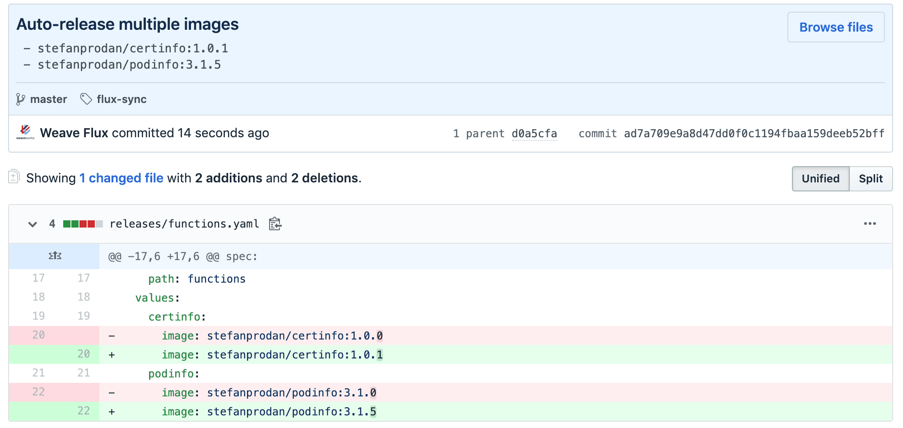

# OpenFaaS GitOps workflow with Flux and Helm v3

This is a step-by-step guide on how to set up a [GitOps](https://www.weave.works/blog/kubernetes-anti-patterns-let-s-do-gitops-not-ciops)
workflow for OpenFaaS with Flux CD and its Helm Operator.
GitOps is a way to do Continuous Delivery, it works by using Git as a source of truth for 
declarative infrastructure and workloads. In practice this means using `git push`
instead of `kubectl apply/delete` or `helm install/upgrade`. 

[OpenFaaS](https://www.openfaas.com/) is an open source function-as-a-service platform for Kubernetes.
With OpenFaaS you can package your code or an existing binary in a Docker image to get a highly scalable endpoint with auto-scaling and metrics. 

[Flux](https://fluxcd.io) is a GitOps operator for Kubernetes that keeps your cluster state is sync with a Git repository.
Because Flux is pull based and also runs inside Kubernetes, you don't have to expose the cluster
credentials outside your production environment.
Once you enable Flux on your cluster any changes in your production environment are done via
pull request with rollback and audit logs provided by Git. 

You can define the desired state of your cluster with Helm charts, Kubernetes deployments, network policies and 
even custom resources like OpenFaaS functions or sealed secrets. Flux implements a control loop that continuously 
applies the desired state to your cluster, offering protection against harmful actions like deployments deletion or 
policies altering.

### Prerequisites

You'll need a Kubernetes cluster v1.11 or newer with load balancer support, a GitHub account, git and kubectl installed locally.

On GitHub, fork the [openfaas-flux](https://github.com/stefanprodan/openfaas-flux) repository and clone it locally
(replace `stefanprodan` with your GitHub username): 

```sh
git clone https://github.com/stefanprodan/openfaas-flux
cd openfaas-flux
```

Install Helm v3 and fluxctl for macOS with Homebrew:

```sh
brew install helm fluxctl
```

On Windows you can use Chocolatey:

```sh
choco install kubernetes-helm fluxctl
```

### Install Flux and Helm Operator

Add FluxCD repository to Helm repos:

```bash
helm repo add fluxcd https://charts.fluxcd.io
```

Create the `fluxcd` namespace:

```sh
kubectl create ns fluxcd
```

Install Flux by specifying your fork URL (replace `stefanprodan` with your GitHub username): 

```bash
helm upgrade -i flux fluxcd/flux --wait \
--namespace fluxcd \
--set git.url=git@github.com:stefanprodan/openfaas-flux 
```

Install the `HelmRelease` Kubernetes custom resource definition:

```sh
kubectl apply -f https://raw.githubusercontent.com/fluxcd/helm-operator/master/deploy/flux-helm-release-crd.yaml
```

Install Flux Helm Operator with ***Helm v3*** support:

```bash
helm upgrade -i helm-operator fluxcd/helm-operator --wait \
--namespace fluxcd \
--set git.ssh.secretName=flux-git-deploy \
--set helm.versions=v3
```

### Setup Git sync

At startup, Flux generates a SSH key and logs the public key. Find the public key with:

```bash
fluxctl identity --k8s-fwd-ns fluxcd
```

In order to sync your cluster state with git you need to copy the public key and 
create a **deploy key** with **write access** on your GitHub repository.

Open GitHub, navigate to your repository, go to _Settings > Deploy keys_ click on _Add deploy key_, check 
_Allow write access_, paste the Flux public key and click _Add key_.

After a couple of seconds Flux will create the `openfaas` and `openfaas-fn` namespaces and will install the OpenFaaS Helm release.

Check the OpenFaaS deployment status:

```
watch kubectl -n openfaas get helmrelease openfaas
```

### Manage Helm releases with Flux

The Helm operator provides an extension to Flux that automates Helm chart releases.
A chart release is described through a Kubernetes custom resource named `HelmRelease`.
The Flux daemon synchronizes these resources from git to the cluster,
and the Helm operator makes sure Helm charts are released as specified in the resources.


Let's take a look at the OpenFaaS definition by running `cat ./releases/openfaas.yaml` inside the git repo:

```yaml
apiVersion: helm.fluxcd.io/v1
kind: HelmRelease
metadata:
  name: openfaas
  namespace: openfaas
spec:
  releaseName: openfaas
  chart:
    repository: https://openfaas.github.io/faas-netes/
    name: openfaas
    version: 5.4.0
  values:
    generateBasicAuth: true
    exposeServices: false
    serviceType: LoadBalancer
    operator:
      create: true
```

The `spec.chart` section tells Flux Helm Operator where is the chart repository and what version to install.
The `spec.values` are user customizations of default parameter values from the chart itself.
Changing the version or a value in git, will make the Helm Operator upgrade the release.

Edit the release and set two replicas for the queue worker with:

```sh
cat << EOF | tee releases/openfaas.yaml
apiVersion: helm.fluxcd.io/v1
kind: HelmRelease
metadata:
  name: openfaas
  namespace: openfaas
spec:
  releaseName: openfaas
  chart:
    repository: https://openfaas.github.io/faas-netes/
    name: openfaas
    version: 5.4.0
  values:
    generateBasicAuth: true
    serviceType: LoadBalancer
    operator:
      create: true
    queueWorker:
      replicas: 2
EOF
```

A list of all supported chart values can be found in the
[faas-netes](https://github.com/openfaas/faas-netes/tree/master/chart/openfaas) repo.

Apply changes via git:

```sh
git add -A && \
git commit -m "scale up queue worker" && \
git push origin master && \
fluxctl sync --k8s-fwd-ns fluxcd
```

Note that Flux does a git-cluster reconciliation every five minutes,
the `fluxctl sync` command can be used to speed up the synchronization.

Check that Helm Operator has upgraded the release and that the queue worker was scaled up:

```sh
watch kubectl -n openfaas get pods
```

Retrieve the OpenFaaS credentials with:

```sh
PASSWORD=$(kubectl -n openfaas get secret basic-auth -o jsonpath="{.data.basic-auth-password}" | base64 --decode) && \
echo "OpenFaaS admin password: $PASSWORD"
```

Find the OpenFaaS gateway load balancer address with:

```sh
kubectl -n openfaas get svc gateway-external -o wide
```

Navigate to the gateway address on port `8080` in your browser and login with the `admin` user and the password retrieved earlier.

### Manage OpenFaaS functions with Flux

An OpenFaaS function is described through a Kubernetes custom resource named `function`.
The Flux daemon synchronizes these resources from git to the cluster,
and the OpenFaaS Operator creates for each function a Kubernetes deployment and a ClusterIP service as 
specified in the resources.



You'll use a Helm chart stored in git to bundle multiple functions and manage the install and upgrade process.

The functions chart contains two function manifests, certinfo and podinfo:

```
./functions/
├── Chart.yaml
├── templates
│   ├── certinfo.yaml
│   └── podinfo.yaml
└── values.yaml
```

You can add. modify or remove functions in the `functions/templates` dir and Flux Helm Operator will create, update or 
delete functions in your cluster according to the changes pushed to the master branch.

Install the chart by setting `fluxcd.io/ignore: "false"` (replace `stefanprodan` with your GitHub username): 

```sh
cat << EOF | tee releases/functions.yaml
apiVersion: helm.fluxcd.io/v1
kind: HelmRelease
metadata:
  name: functions
  namespace: openfaas-fn
  annotations:
    fluxcd.io/ignore: "false"
spec:
  releaseName: functions
  chart:
    git: git@github.com:stefanprodan/openfaas-flux
    ref: master
    path: functions
EOF
```

The above manifest instructs Helm Operator to clone the git repository using Flux SSH key
and install or upgrade the `functions` chart in the openfaas-fn namespace.

Apply changes via git:

```sh
git add -A && \
git commit -m "install functions" && \
git push origin master && \
fluxctl sync --k8s-fwd-ns fluxcd
```

List the installed functions with:

```sh
kubectl -n openfaas-fn get functions
```

Invoke the certinfo function with:

```sh
curl -d "openfaas.com" http://<GATEWAY_ADDRESS>:8080/function/certinfo
```

### Automate OpenFaaS functions updates

Flux can be used to automate container image updates in your cluster.
Flux periodically scans the pods running in your cluster and builds a list of all container images.
Using the image pull secrets, it connects to the container registries,
pulls the images metadata and stores the image tag list in memcached.



You can enable the automate image tag updates by annotating your HelmReleases objects.
You can also control what tags should be considered for an update by using glob, regex or semantic version expressions.

Edit the functions release and add container image update policies for the OpenFaaS functions
(replace `stefanprodan` with your GitHub username): 

```sh
cat << EOF | tee releases/functions.yaml
apiVersion: helm.fluxcd.io/v1
kind: HelmRelease
metadata:
  name: functions
  namespace: openfaas-fn
  annotations:
    fluxcd.io/automated: "true"
    filter.fluxcd.io/certinfo: semver:~1.0
    filter.fluxcd.io/podinfo: semver:~3.1
spec:
  releaseName: functions
  chart:
    git: git@github.com:stefanprodan/openfaas-flux
    ref: master
    path: functions
  values:
    certinfo:
      image: stefanprodan/certinfo:1.0.0
    podinfo:
      image: stefanprodan/podinfo:3.1.0
EOF
```

The above annotations tell Flux to update the Helm release `values.<function>.image` 
every time a new image is pushed to Docker Hub with a tag that matches the semver filter.
Note that Flux only works with immutable image tags (`:latest` is not supported).
Every image tag must be unique, for this you can use the Git commit SHA or semver when tagging images.

Apply the update policies via git:

```sh
git add -A && \
git commit -m "enable functions updates" && \
git push origin master && \
fluxctl sync --k8s-fwd-ns fluxcd
```

Once the automation is enabled, Flux will apply the semver filter and update the functions images in git and in the cluster:



Verify that podinfo version has been updated:

```
$ curl -s http://<GATEWAY_ADDRESS>:8080/function/podinfo/api/info | grep version

"version": "3.1.5"
```

### Encrypt Kubernetes secrets in git

In order to store secrets safely in a public Git repo you can use the
[Sealed Secrets controller](https://github.com/bitnami-labs/sealed-secrets)
and encrypt your Kubernetes Secrets into SealedSecrets.
The SealedSecret can be decrypted only by the controller running in your cluster.

The Sealed Secrets controller has been installed by Flux in the `fluxcd` namespace,
the Helm release can be found in `releases/sealed-secrets.yaml`.

Install the kubeseal CLI:

```sh
brew install kubeseal
```

At startup, the sealed-secrets controller generates a RSA key and logs the public key.
Using kubeseal you can save your public key as `pub-cert.pem`,
the public key can be safely stored in Git, and can be used to encrypt secrets without direct access to the Kubernetes cluster:

```sh
kubeseal --fetch-cert \
--controller-namespace=adm \
--controller-name=sealed-secrets \
> pub-cert.pem
```

Generate a Kubernetes secret locally with kubectl:

```bash
kubectl create secret generic db-credentials \
--from-literal=user=my-db-user \
--from-literal=password=my-db-pass \
--dry-run \
-o json > db-credentials.json
```

Encrypt the secret with kubeseal and add it to the functions chart:

```sh
kubeseal --format=yaml --cert=pub-cert.pem \
< db-credentials.json > functions/templates/db-credentials.yaml
```

Edit certinfo and add the secret to the function definition:

```sh
cat << EOF | tee functions/templates/certinfo.yaml
apiVersion: openfaas.com/v1alpha2
kind: Function
metadata:
  name: certinfo
  labels:
{{ include "functions.labels" . | indent 4 }}
spec:
  name: certinfo
  image: {{ .Values.certinfo.image }}
  readOnlyRootFilesystem: true
  secrets:
    - db-credentials
EOF
```

The above configuration instructs the OpenFaaS operator to mount the db-credentials secret as a file inside the function
container at `/var/openfaas/secrets/`.

Delete the plain text secret and apply changes via git:

```sh
rm db-credentials.json && \
git add -A && \
git commit -m "add db credentials" && \
git push origin master && \
fluxctl sync --k8s-fwd-ns fluxcd
```

Flux will apply the sealed secret on your cluster and sealed-secrets controller will then decrypt it into a
Kubernetes secret.


You can read more about secrets management on the OpenFaaS docs [website](https://docs.openfaas.com/reference/secrets/).

### Developer workflow

You'll be using the OpenFaaS CLI to create functions, build and push them to a container registry.

Install faas-cli and login to your instance:

```sh
curl -sL https://cli.openfaas.com | sudo sh

echo $PASSWORD | faas-cli login -u admin --password-stdin \
--gateway http://<GATEWAY_ADDRESS>:8080
```

Create a function using the Go template (replace `stefanprodan` with your Docker Hub username):

```sh
faas-cli new myfn --lang go --prefix stefanprodan
```

Implement your function logic by editing the `myfn/handler.go` file.

Initialize a Git repository for your function and commit your changes:

```sh
git init
git add . && git commit -s -m "Init function"
```

Build the container image by tagging it with the Git branch and commit short SHA:

```sh
$ faas-cli build --tag branch -f myfn.yml

Image: stefanprodan/myfn:latest-master-eb656a6 built.
```

Push the image to Docker Hub with:

```sh
$ faas-cli push --tag branch -f myfn.yml

Pushing myfn [stefanprodan/myfn:latest-master-eb656a6] done.
```

Generate the function Kubernetes custom resource with:

```sh
faas-cli generate -n "" --tag branch --yaml myfn.yml > myfn-k8s.yaml
```

Edit the generated YAML so that Flux can use Helm to control the version and labels:

```sh
cat << EOF | tee functions/templates/myfn.yaml
apiVersion: openfaas.com/v1alpha2
kind: Function
metadata:
  name: myfn
  labels:
{{ include "functions.labels" . | indent 4 }}
spec:
  name: myfn
  image: {{ .Values.myfn.image }}
EOF
```

Add your function container image to the chart values.yaml:

```sh
cat << EOF | tee functions/values.yaml
certinfo:
  image: stefanprodan/certinfo:1.0.0
podinfo:
  image: stefanprodan/podinfo:3.1.0
myfn:
  image: stefanprodan/myfn:latest-master-eb656a6
EOF
```

Add your function to the Helm release and set a Flux filter using a glob expression:

```sh
cat << EOF | tee releases/functions.yaml
apiVersion: helm.fluxcd.io/v1
kind: HelmRelease
metadata:
  name: functions
  namespace: openfaas-fn
  annotations:
    fluxcd.io/automated: "true"
    filter.fluxcd.io/certinfo: semver:~1.0
    filter.fluxcd.io/podinfo: semver:~3.1
    filter.fluxcd.io/myfn: glob:latest-master-*
spec:
  releaseName: functions
  chart:
    git: git@github.com:stefanprodan/openfaas-flux
    ref: master
    path: functions
  values:
    certinfo:
      image: stefanprodan/certinfo:1.0.0
    podinfo:
      image: stefanprodan/podinfo:3.1.0
    myfn:
      image: stefanprodan/myfn:latest-master-eb656a6
EOF
```

To automate the whole process you can use the [OpenFaaS GitHub action](https://github.com/LucasRoesler/openfaas-action)
to run faas-cli build and push on every commit to the master branch.
Flux will detect master builds and will deploy the new images to your cluster.
