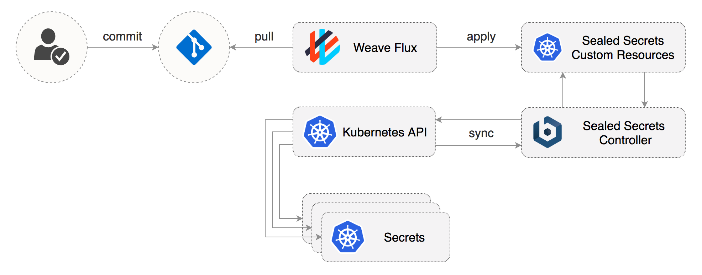
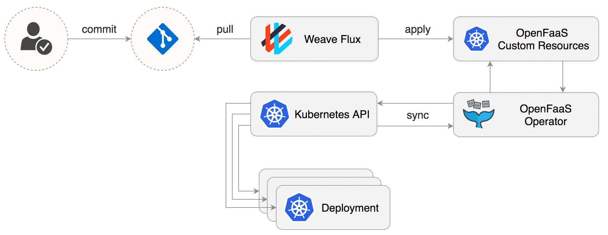
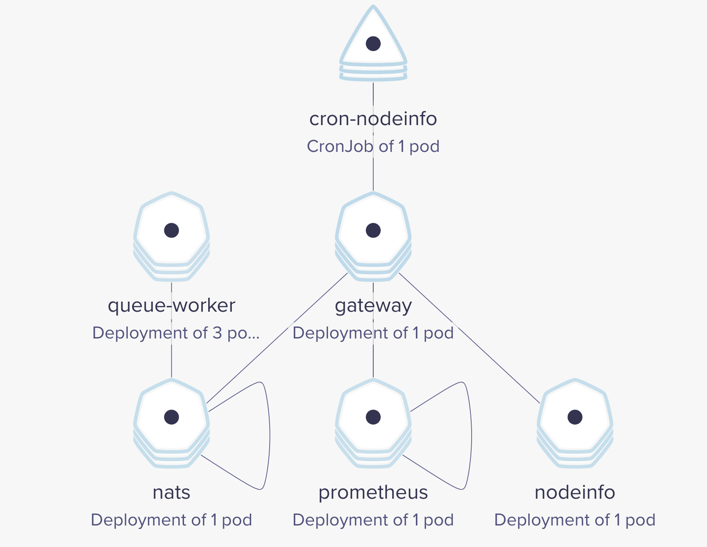
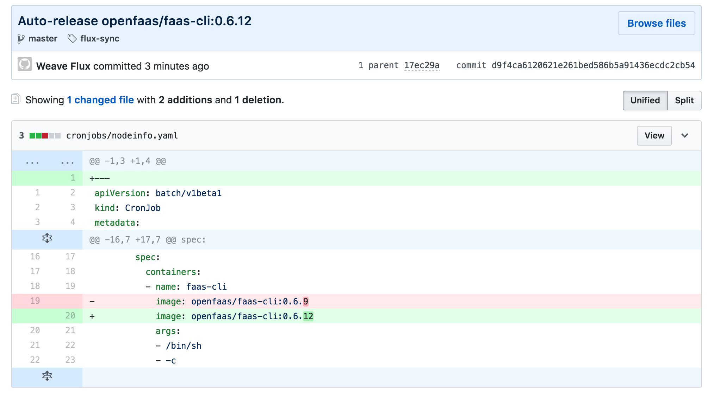
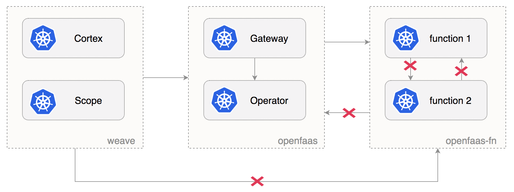

# OpenFaaS GitOps workflow with Weave Flux 

This is a step by step guide on how to set up a GitOps workflow for OpenFaaS with Weave Flux. 
GitOps is a way to do Continuous Delivery, it works by using Git as a source of truth for 
declarative infrastructure and workloads. 
In practice this means using `git push` instead of `kubectl create/apply` or `helm install/upgrade`. 

OpenFaaS (Functions as a Service) is Serverless Functions Made Simple for Docker and Kubernetes. 
With OpenFaaS you can package any container or binary as a serverless function - from Node.js to Golang to C# on 
Linux or Windows. 

Weave Flux is a GitOps Operator for Kubernetes that keeps your cluster state is sync with a Git repository.
Because Flux is pull based and also runs inside Kubernetes, you don't have to expose the cluster 
credentials outside your production environment. Once you enable Flux on your cluster any changes in your production environment are done via pull request with rollback and audit logs provided by Git. 

You can define the desired state of your cluster with Helm charts, Kubernetes deployments, network policies and 
even custom resources like OpenFaaS functions or sealed secrets. Weave Flux implements a control loop that continuously 
applies the desired state to your cluster, offering protection against harmful actions like deployments deletion or 
network policies altering. 

### Install Weave Flux with Helm

Add the Weave Flux chart repo:

```bash
helm repo add weaveworks https://weaveworks.github.io/flux
```

Install Weave Flux and its Helm Operator by specifying your fork URL 
(replace `stefanprodan` with your GitHub username): 

```bash
helm install --name flux \
--set helmOperator.create=true \
--set git.url=git@github.com:stefanprodan/openfaas-flux \
--set git.chartsPath=charts \
--namespace flux \
weaveworks/flux
```

You can connect Weave Flux to Weave Cloud using a service token:

```bash
helm install --name flux \
--set token=YOUR_WEAVE_CLOUD_SERVICE_TOKEN \
--set helmOperator.create=true \
--set git.url=git@github.com:stefanprodan/openfaas-flux \
--set git.chartsPath=charts \
--namespace flux \
weaveworks/flux
```

Note that Flux Helm Operator works with Kubernetes 1.9 or newer.

### Setup Git sync

At startup, Flux generates a SSH key and logs the public key. 
Find the SSH public key with:

```bash
kubectl -n flux logs deployment/flux | grep identity.pub 
```

In order to sync your cluster state with git you need to copy the public key and 
create a **deploy key** with **write access** on your GitHub repository.

Open GitHub and fork this repo, navigate to your fork, go to _Settings > Deploy keys_ click on _Add deploy key_, check 
_Allow write access_, paste the Flux public key and click _Add key_.

After a couple of seconds Flux: 

* creates the `openfaas` and `openfaas-fn` namespaces
* installs OpenFaaS Helm release
* creates the OpenFaaS functions

Check the OpenFaaS services deployment status:

```
kubectl -n openfaas get deployments
NAME           DESIRED   CURRENT   UP-TO-DATE   AVAILABLE   AGE
gateway        1         0         0            0           49s
nats           1         1         1            1           49s
prometheus     1         1         1            1           49s
queue-worker   3         3         3            3           49s
```

At this stage the gateway is not exposed outside the cluster and will enter a crash loop because it tries to mount 
the basic auth credentials from a secret that's not yet present on the cluster.

### Manage Helm releases with Weave Flux

The Flux Helm operator provides an extension to Weave Flux that automates Helm Chart releases for it.
A Chart release is described through a Kubernetes custom resource named `FluxHelmRelease`.
The Flux daemon synchronizes these resources from git to the cluster,
and the Flux Helm operator makes sure Helm charts are released as specified in the resources.


OpenFaaS release definition:

```yaml
apiVersion: helm.integrations.flux.weave.works/v1alpha2
kind: FluxHelmRelease
metadata:
  name: openfaas
  namespace: openfaas
  labels:
    chart: openfaas
spec:
  chartGitPath: openfaas
  releaseName: openfaas
  values:
    basic_auth:
      enabled: true
    gateway:
      image: openfaas/gateway:0.8.5
      replicas: 2
    operator:
      image: functions/openfaas-operator:0.8.0
    queueWorker:
      image: functions/queue-worker:0.4.4
      replicas: 3
    nats:
      image: nats-streaming:0.6.0
    prometheus:
      image: prom/prometheus:v2.3.1
```

Flux Helm release fields:
* `metadata.name` is mandatory and needs to follow k8s naming conventions
* `metadata.namespace` is optional and determines where the release is created
* `metadata.labels.chart` is mandatory and should match the directory containing the chart
* `spec.releaseName` is optional and if not provided the release name will be `$namespace-$name`
* `spec.chartGitPath` is the directory containing the chart, given relative to the charts path
* `spec.values` are user customizations of default parameter values from the chart itself

The following Helm [releases](releases) are part of this setup:

* [openfaas](releases/openfaas.yaml) (OpenFaaS Gateway, OpenFaaS K8s Operator, Prometheus, NATS, OpenFaaS Queue Worker)
* [sealed-secrets](releases/sealed-secrets.yaml) (Bitnami SealedSecrets K8s Controller)
* [contour](releases/contour.yaml) (Heptio Contour Envoy based K8s Ingress Controller)
* [cert-manager](releases/cert-manager.yaml) (Jetstack CertManager K8s Controller with Let's Encrypt support)

### Manage Secrets with Bitnami Sealed Secrets Controller and Weave Flux

On the first Git sync, Flux deploys the Bitnami Sealed Secrets Controller. 
Sealed-secrets is a Kubernetes Custom Resource Definition Controller that allows you to store 
sensitive information in Git.



In order to encrypt secrets you have to install the `kubeseal` CLI:

```bash
release=$(curl --silent "https://api.github.com/repos/bitnami-labs/sealed-secrets/releases/latest" | sed -n 's/.*"tag_name": *"\([^"]*\)".*/\1/p')
GOOS=$(go env GOOS)
GOARCH=$(go env GOARCH)
wget https://github.com/bitnami/sealed-secrets/releases/download/$release/kubeseal-$GOOS-$GOARCH
sudo install -m 755 kubeseal-$GOOS-$GOARCH /usr/local/bin/kubeseal
```

Navigate to `./secrets` dir and delete all files inside. 

```bash
rm -rf secrets && mkdir secrets
```

At startup, the Sealed Secrets Controller generates a RSA key and logs the public key. 
Using `kubeseal` you can save your public key as `pub-cert.pem`, 
the public key can be safely stored in Git, and you can use it to encrypt secrets **offline**:

```bash
kubeseal --fetch-cert \
--controller-namespace=flux \
--controller-name=sealed-secrets \
> secrets/pub-cert.pem
```

Next let's create a secret with the basic auth credentials for the OpenFaaS Gateway. 

Use `kubectl` to locally generate the basic-auth secret:

```bash
password=$(head -c 12 /dev/random | shasum| cut -d' ' -f1)
echo $password

kubectl -n openfaas create secret generic basic-auth \
--from-literal=basic-auth-user=admin \
--from-literal=basic-auth-password=$password \
--dry-run \
-o json > basic-auth.json
```

Encrypt the secret with `kubeseal` and save it in the `secrets` dir:

```bash
kubeseal --format=yaml --cert=secrets/pub-cert.pem < basic-auth.json > secrets/basic-auth.yaml
```

This generates a custom resource of type `SealedSecret` that contains the encrypted credentials:

```yaml
apiVersion: bitnami.com/v1alpha1
kind: SealedSecret
metadata:
  name: basic-auth
  namespace: openfaas
spec:
  encryptedData:
    basic-auth-password: AgAR5nzhX2TkJ.......
    basic-auth-user: AgAQDO58WniIV3gTk.......
``` 

Finally delete the `basic-auth.json` file and commit your changes:

```bash
rm basic-auth.json
git add . && git commit -m "Add OpenFaaS basic auth credentials" && git push
```

The Flux daemon applies the sealed secret on your cluster. The Sealed Secrets Controller will then decrypt it into a 
Kubernetes secret. 

Now that the OpenFaaS credentials are stored in the cluster you can access the Gateway UI
on your local machine at `http://localhost:8080` with port forwarding:

```bash
kubectl -n openfaas port-forward deployment/gateway 8080:8080
```

### Expose OpenFaaS Gateway outside the cluster with Envoy and LE TLS

Inside the [releases](releases) dir you can find a Helm release definition for Heptio Contour.
Contour is a Kubernetes ingress controller powered by the Envoy proxy. 

Find the Contour LoadBalancer pubic IP (depending on your cloud provider this can take several minutes):

```bash
public-ip=$(kubectl -n contour describe service contour | grep Ingress | awk '{ print $NF }')
```

If you run Kubernetes on-prem or on bare-metal, you should change the Contour [service](releases/contour.yaml)
type from LoadBalancer to NodePort to expose OpenFaaS on the internet.

In order to setup TLS with Let's Encrypt you should point your DNS to the Contour LoadBalancer IP.

Once the DNS is set you can use Jetstack's cert-manager to request a TLS certificate for your domain from LE.

Create a cluster issuer definition in the [certs](certs) dir,
replace `EMAIL@DOMAIN.NAME` with a valid email address:

```yaml
apiVersion: certmanager.k8s.io/v1alpha1
kind: ClusterIssuer
metadata:
  name: openfaas
  namespace: cert-manager
spec:
  acme:
    email: EMAIL@DOMAIN.NAME
    http01: {}
    privateKeySecretRef:
      name: openfaas-cert
    server: https://acme-v01.api.letsencrypt.org/directory
```

Add the ingress definition to [releases/openfaas.yaml](releases/openfaas.yaml),
replace `DOMAIN.NAME` with your own domain:

```yaml
apiVersion: helm.integrations.flux.weave.works/v1alpha2
kind: FluxHelmRelease
metadata:
  name: openfaas
  namespace: openfaas
  labels:
    chart: openfaas
spec:
  chartGitPath: openfaas
  releaseName: openfaas
  values:
    ingress:
      enabled: true
      annotations:
        kubernetes.io/ingress.class: "contour"
        certmanager.k8s.io/cluster-issuer: "openfaas"
      hosts:
        - host: DOMAIN.NAME
          serviceName: gateway
          servicePort: 8080
          path: /
      tls:
        - secretName: openfaas-cert
          hosts:
          - DOMAIN.NAME
```

Commit and push your changes to Git:

```bash
git add . && git commit -m "Add OpenFaaS TLS ingress" && git push
```

After Flux applies the changes, you can check cert-manager logs and see if your certificate
has been issued by letsencrypt.org:

```bash
kubectl -n cert-manager logs deployment/cert-manager cert-manager

sync.go:238] Preparing certificate with issuer
controller.go:152] clusterissuers controller: Finished processing work item "openfaas"
sync.go:248] Issuing certificate...
sync.go:269] Certificated issued successfully
controller.go:187] certificates controller: syncing item 'openfaas/openfaas-cert'
sync.go:200] Certificate scheduled for renewal in 1438 hours
```

Verify the LE cert using `certinfo` function:

```bash
curl -d "your-domain.name" https://your-domain.name/function/certinfo

Host 35.189.75.57
Port 443
Issuer Let's Encrypt Authority X3
CommonName openfaas.your-domain.name
NotBefore 2018-05-23 07:15:20 +0000 UTC
NotAfter 2018-08-21 07:15:20 +0000 UTC
SANs [openfaas.your-domain.name]
TimeRemaining 2 months from now
```

### Manage OpenFaaS functions and auto-scaling with Weave Flux

An OpenFaaS function is described through a Kubernetes custom resource named `function`.
The Flux daemon synchronizes these resources from git to the cluster,
and the OpenFaaS Operator creates for each function a Kubernetes deployment and a ClusterIP service as 
specified in the resources.



OpenFaaS function definition:

```yaml
apiVersion: openfaas.com/v1alpha2
kind: Function
metadata:
  name: sentimentanalysis
  namespace: openfaas-fn
spec:
  name: sentimentanalysis
  image: functions/sentimentanalysis
  environment:
    output: "verbose"
  limits:
    cpu: "2000m"
    memory: "512Mi"
  requests:
    cpu: "10m"
    memory: "64Mi"
```

Since sentiment analysis is a ML function you will probably want to auto-scale it based on resource usage. 
You can use the Kubernetes horizontal pod autoscaler to automatically scale a function based on the average CPU usage and 
memory consumption. 

```yaml
apiVersion: autoscaling/v2beta1
kind: HorizontalPodAutoscaler
metadata:
  name: sentimentanalysis
  namespace: openfaas-fn
spec:
  scaleTargetRef:
    apiVersion: apps/v1beta2
    kind: Deployment
    name: sentimentanalysis
  minReplicas: 1
  maxReplicas: 10
  metrics:
  - type: Resource
    resource:
      name: cpu
      targetAverageUtilization: 50
  - type: Resource
    resource:
      name: memory
      targetAverageValue: 400Mi
```

Let's run a load test to validate that HPA works as expected: 

```bash
go get -u github.com/rakyll/hey
hey -n 100000 -c 10 -q 1 -d "$(cat README.md)" http://localhost:8080/function/sentimentanalysis
``` 

Monitor the autoscaler with:

```bash
kubectl -n openfaas-fn describe hpa

Events:
  Type    Reason             Age   From                       Message
  ----    ------             ----  ----                       -------
  Normal  SuccessfulRescale  12m   horizontal-pod-autoscaler  New size: 1; reason: All metrics below target
  Normal  SuccessfulRescale  4m    horizontal-pod-autoscaler  New size: 4; reason: cpu resource utilization (percentage of request) above target
  Normal  SuccessfulRescale  1m    horizontal-pod-autoscaler  New size: 8; reason: cpu resource utilization (percentage of request) above target
```

### Manage OpenFaaS cron jobs

Running functions on a schedule can be done with Kubernetes ConJobs and the OpenFaaS CLI:



```yaml
apiVersion: batch/v1beta1
kind: CronJob
metadata:
  name: cron-nodeinfo
  namespace: openfaas
  annotations:
    flux.weave.works/automated: "true"
spec:
  schedule: "*/1 * * * *"
  concurrencyPolicy: Forbid
  successfulJobsHistoryLimit: 1
  failedJobsHistoryLimit: 3
  jobTemplate:
    spec:
      template:
        spec:
          containers:
          - name: faas-cli
            image: openfaas/faas-cli:0.6.9
            args:
            - /bin/sh
            - -c
            - echo "verbose" | ./faas-cli invoke nodeinfo -g http://gateway:8080
          restartPolicy: OnFailure
```

The above cron job calls the `nodeinfo` function every minute using `verbose` as payload.

You can instruct Flux to update the cron job container image by adding the
`flux.weave.works/automated` annotation. 

When a new tag is pushed to Docker Hub, Flux will change the cron job definition in the yaml file, will commit and push 
the change to your git repo and finally will apply the change on your cluster. 



### Manage Network Policies with Weave Flux

If you use a CNI like Weave Net or Calico that supports network policies you can enforce traffic rules for OpenFaaS 
by placing the `NetworkPolicy` definitions inside the `network-policies` dir. 
The Flux daemon will apply the policies on your cluster along with the namespaces labels.



Deny ingress access to functions except from namespaces with `role: openfaas-system` label:

```yaml
apiVersion: networking.k8s.io/v1
kind: NetworkPolicy
metadata:
  name: openfaas-fn
  namespace: openfaas-fn
spec:
  policyTypes:
  - Ingress
  podSelector: {}
  ingress:
  - from:
    - namespaceSelector:
        matchLabels:
          role: openfaas-system
```

Allow OpenFaaS core services to reach the `openfaas-fn` namespace by applying the `role: openfaas-system` label:

```yaml
apiVersion: v1
kind: Namespace
metadata:
  name: openfaas
  labels:
    role: openfaas-system
    access: openfaas-system
```

Deny ingress access to OpenFaaS core services except from namespaces with `access: openfaas-system` label:

```yaml
kind: NetworkPolicy
apiVersion: networking.k8s.io/v1
metadata:
  name: openfaas
  namespace: openfaas
spec:
  policyTypes:
  - Ingress
  podSelector: {}
  ingress:
  - from:
    - namespaceSelector:
        matchLabels:
          access: openfaas-system
```

Allow Weave Cloud to scrape the OpenFaaS Gateway by applying the `access: openfaas-system` label to `weave` namespace:

```yaml
apiVersion: v1
kind: Namespace
metadata:
  name: weave
  labels:
    access: openfaas-system
```

### Disaster Recovery 

In order to recover from a major disaster like a cluster melt down, all you need to to is create a new Kubernetes cluster, 
deploy Flux with Helm and update the SSH public key in the GitHub repo. 
Weave Flux will restore all workloads on the new cluster, the only manifests that will fail to apply will be the sealed 
secrets since the private key used for decryption will have changed. 

To prepare for disaster recovery you should backup the SealedSecrets private key with:

```bash
kubectl get secret -n flux sealed-secrets-key -o yaml --export > sealed-secrets-key.yaml
```

To restore from backup after a disaster, replace the newly-created secret and restart the sealed-secrets controller:

```bash
kubectl replace secret -n flux sealed-secrets-key -f sealed-secrets-key.yaml
kubectl delete pod -n flux -l app=sealed-secrets
```

Once the correct private key is in place, the sealed-secrets controller will create the Kubernetes secrets and your 
OpenFaaS cluster will be fully restored.

