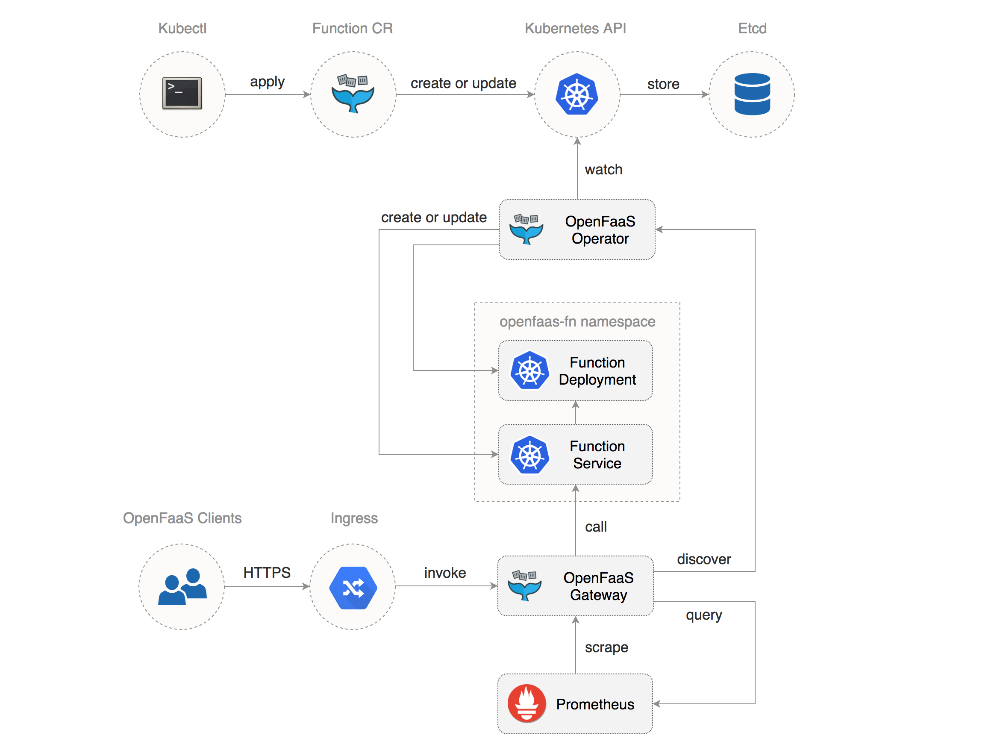

# Introducing the OpenFaaS Kubernetes Operator 

The OpenFaaS Operator is an extension to the Kubernetes API that allows you to manage OpenFaaS functions
in a declarative manner. The OpenFaaS Operator implements a control loop that tries to match the desired state of your 
OpenFaaS functions defined as a collection of custom resources with the actual state of your cluster. 

The OpenFaaS Operator is a drop-in replacement of the faas-netes controller. Some of the advantages of switching to the Operator are:

* declarative API (Operator) vs imperative API (faas-netes)
* use kubectl and/or faas-cli for functions CRUD operations (Operator) vs faas-cli only (faas-netes)
* on deletion, functions are garbage collected by the Kubernetes API (Operator) vs explicit deletion of a function deployment and ClusterIP service (faas-netes)
* query the function status via the Kubernetes API (Operator) vs query the status using faas-netes HTTP API
* due to the reconciliation loop the Operator can handle transient Kubernetes API outages while faas-netes has no retry mechanism



### Install 

Deploy OpenFaaS with faas-netes:

```bash
git clone https://github.com/openfaas/faas-netes
cd faas-netes
kubectl apply -f ./namespaces.yml,./yaml
```

Deploy the Gateway with openfaas-operator sidecar in the `openfaas` namespace:

```bash
git clone https://github.com/openfaas-incubator/openfaas-operator
cd openfaas-operator

# CRD
kubectl apply -f artifacts/operator-crd.yaml

# RBAC
kubectl apply -f artifacts/operator-rbac.yaml

# Deployment (use operator-armhf.yaml for ARM)
kubectl apply -f artifacts/operator-amd64.yaml
```

Delete faas-netes:

```yaml
kubectl -n openfaas delete deployment faas-netesd
kubectl -n openfaas delete svc faas-netesd
```

If you've used faas-netes to run functions, you have to delete them and redeploy using faas-cli or kubectl.

### Usage 

Using the OpenFaaS Operator you can define functions as a Kubernetes custom resource:

```yaml
apiVersion: openfaas.com/v1alpha2
kind: Function
metadata:
  name: certinfo
  namespace: openfaas-fn
spec:
  name: certinfo
  image: stefanprodan/certinfo
  # translates to Kubernetes metadata.labels
  labels:
    # if you plan to use Kubernetes HPA v2 
    # delete the min/max labels and 
    # set the factor to 0 to disable auto-scaling based on req/sec
    com.openfaas.scale.min: "2"
    com.openfaas.scale.max: "12"
    com.openfaas.scale.factor: "4"
  # translates to Kubernetes container.env
  environment:
    output: "verbose"
    debug: "true"
  # secrets are mounted as readonly files at /var/openfaas/
  # if you use a private registry add your image pull secret to the list 
  secrets:
    - my-key
    - my-token
  # translates to Kubernetes resources.limits
  limits:
    cpu: "1000m"
    memory: "128Mi"
  # translates to Kubernetes resources.requests
  requests:
    cpu: "10m"
    memory: "64Mi"
  # translates to Kubernetes nodeSelector
  constraints:
    - "beta.kubernetes.io/arch=amd64"
```

Save the above resource as `certinfo.yaml` and use kubectl to deploy the function:

```bash
kubectl -n openfaas-fn apply -f certinfo.yaml
```

Since certinfo requires the `my-key` and `my-token` secrets, the Operator will not be able to create a deployment but 
will keep retrying.
You can view the operator logs with:

```bash
kubectl -n openfaas logs deployment/gateway -c operator

controller.go:215] error syncing 'openfaas-fn/certinfo': secret "my-key" not found
```

Let's create the secrets:

```bash
kubectl -n openfaas-fn create secret generic my-key --from-literal=my-key=demo-key
kubectl -n openfaas-fn create secret generic my-token --from-literal=my-token=demo-token
```

Once the secrets are in place the Operator will proceed with the certinfo deployment. You can get the status of the 
running functions with:

```yaml
kubectl -n openfaas-fn get functions
NAME                AGE
certinfo            4m

kubectl -n openfaas-fn get deployments
NAME                DESIRED   CURRENT   UP-TO-DATE   AVAILABLE   AGE
certinfo            1         1         1            1           1m
```

Test that secrets are available inside the certinfo pod at `var/openfaas/`:

```bash
export CERT_POD=$(kubectl get pods -n openfaas-fn -l "app=certinfo" -o jsonpath="{.items[0].metadata.name}")
kubectl -n openfaas-fn exec -it $CERT_POD -- sh

~ $ cat /var/openfaas/my-key 
demo-key

~ $ cat /var/openfaas/my-token 
demo-token
``` 

You can delete a function with:

```bash
kubectl -n openfaas-fn delete function certinfo
```

