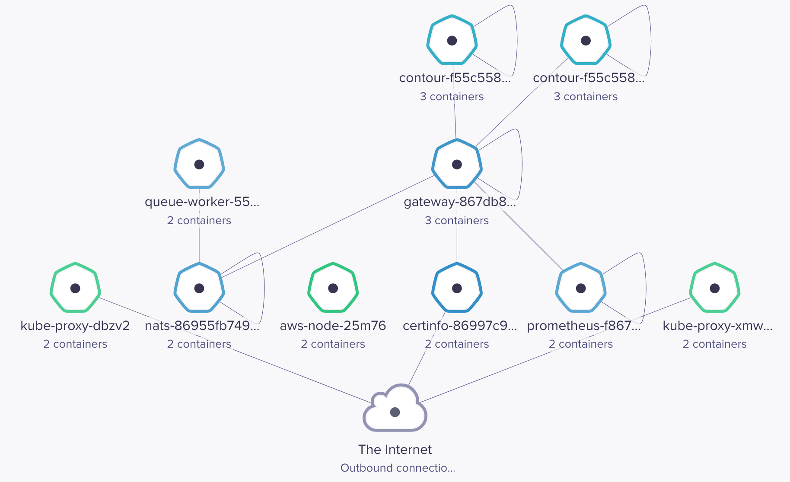
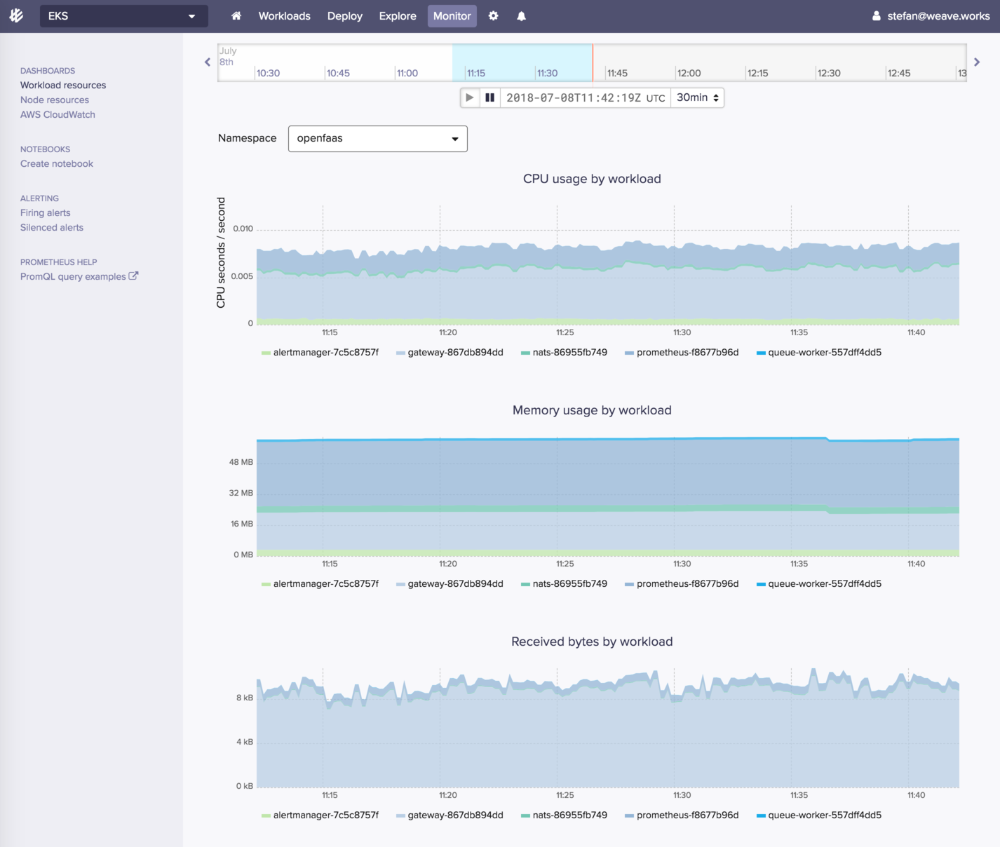
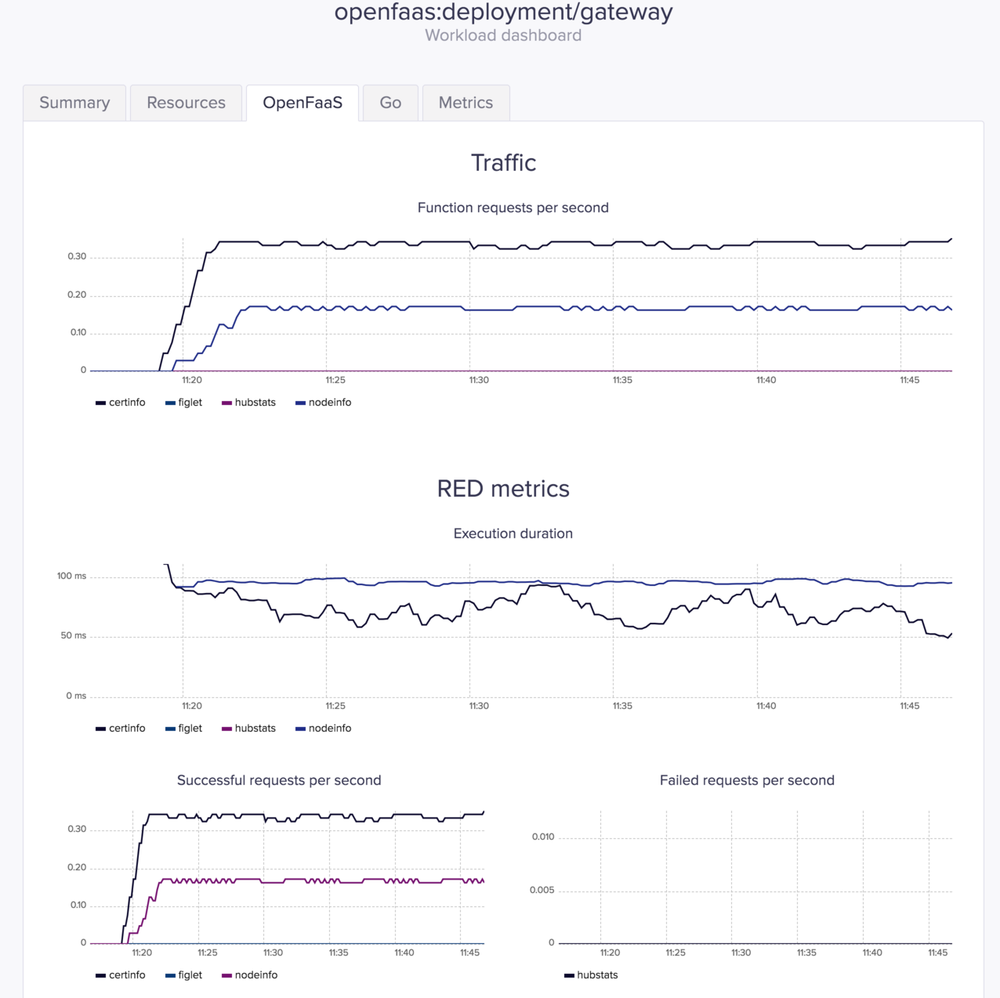
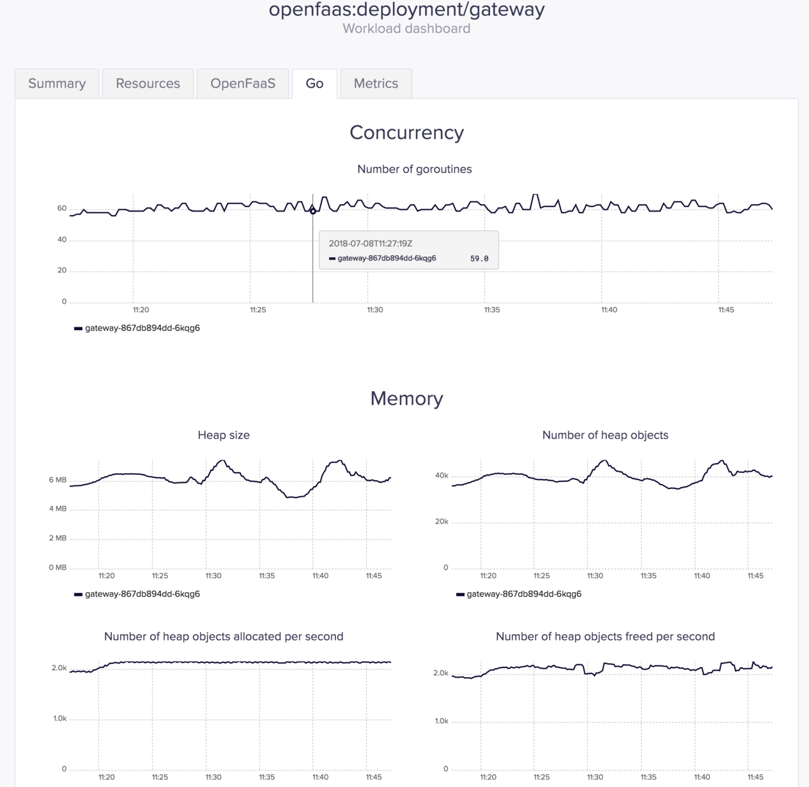

# Getting started with OpenFaaS Kubernetes Operator on EKS

The OpenFaaS team has recently released a Kubernetes operator for OpenFaaS. 
For an overview of why and how we created the operator head to Alex Ellis' blog and read the [Introducing the OpenFaaS Operator for Serverless on Kubernetes](https://blog.alexellis.io/introducing-the-openfaas-operator/). 

The OpenFaaS Operator can be run with OpenFaaS on any Kubernetes service, 
in this post I will show you step-by-step instructions of how to deploy to Amazon's managed Kubernetes service (EKS).

The OpenFaaS Operator comes with an extension to the Kubernetes API that allows you to manage OpenFaaS functions
in a declarative manner. The operator implements a control loop that tries to match the desired state of your 
OpenFaaS functions defined as a collection of custom resources with the actual state of your cluster. 


### Setup a Kubernetes cluster with eksctl

In order to create an EKS cluster you can use [eksctl](https://eksctl.io). 
Eksctl is an open source command-line made by Weaveworks in collaboration with Amazon, 
it's written in Go and based on EKS CloudFormation templates.

On MacOS you can install eksctl with Homebrew:

```bash
brew install weaveworks/tap/eksctl
```

Create an EKS cluster with:

```bash
eksctl create cluster --name=openfaas \
    --nodes=2 \
    --region=us-west-2 \
    --node-type=m5.xlarge \
    --auto-kubeconfig
```

Eksclt offers many options when creating a cluster:

```bash
$ eksctl create cluster --help

Usage:
  eksctl create cluster [flags]

Flags:
      --auto-kubeconfig            save kubconfig file by cluster name, e.g. "/Users/stefan/.kube/eksctl/clusters/extravagant-wardrobe-1531126688"
      --aws-api-timeout duration   number of seconds after which to timeout AWS API operations (default 20m0s)
      --full-ecr-access            enable full access to ECR
  -h, --help                       help for cluster
      --kubeconfig string          path to write kubeconfig (incompatible with --auto-kubeconfig) (default "/Users/aleph/.kube/config")
  -n, --name string                EKS cluster name (generated if unspecified, e.g. "extravagant-wardrobe-1531126688")
  -t, --node-type string           node instance type (default "m5.large")
  -N, --nodes int                  total number of nodes (for a static ASG) (default 2)
  -M, --nodes-max int              maximum nodes in ASG
  -m, --nodes-min int              minimum nodes in ASG
  -p, --profile string             AWS creditials profile to use (overrides the AWS_PROFILE environment variable)
  -r, --region string              AWS region (default "us-west-2")
      --set-kubeconfig-context     if true then current-context will be set in kubeconfig; if a context is already set then it will be overwritten (default true)
      --ssh-public-key string      SSH public key to use for nodes (import from local path, or use existing EC2 key pair) (default "~/.ssh/id_rsa.pub")
      --write-kubeconfig           toggle writing of kubeconfig (default true)
```

Connect to the EKS cluster using the generated config file:

```bash
export KUBECONFIG=~/.kube/eksctl/clusters/openfaas
kubectl get nodes
```

You will be using Helm to install OpenFaaS, for Helm to work with EKS you need version 2.9.1 or newer.

Install Helm CLI with Homebrew:

```bash
brew install kubernetes-helm
```

Create a service account and cluster role binding for Tiller:

```bash
kubectl -n kube-system create sa tiller

kubectl create clusterrolebinding tiller-cluster-rule \
    --clusterrole=cluster-admin \
    --serviceaccount=kube-system:tiller 
```

Deploy Tiller on EKS:

```bash
helm init --skip-refresh --upgrade --service-account tiller
```

### Install OpenFaaS with Helm

Create the OpenFaaS namespaces:

```bash
kubectl apply -f https://raw.githubusercontent.com/openfaas/faas-netes/master/namespaces.yml
```

Generate a random password and create OpenFaaS credentials secret:

```bash
password=$(head -c 12 /dev/urandom | shasum| cut -d' ' -f1)

kubectl -n openfaas create secret generic basic-auth \
--from-literal=basic-auth-user=admin \
--from-literal=basic-auth-password=$password
```

Install OpenFaaS from the project helm repository:

```bash
helm repo add openfaas https://openfaas.github.io/faas-netes/

helm upgrade openfaas --install openfaas/openfaas \
    --namespace openfaas  \
    --set functionNamespace=openfaas-fn \
    --set serviceType=LoadBalancer \
    --set basic_auth=true \
    --set operator.create=true
```

Find the gateway address (it could take some time for the ELB to be online):

```yaml
export OPENFAAS_URL=$(kubectl -n openfaas describe svc/gateway-external | grep Ingress | awk '{ print $NF }'):8080
```

Run `echo http://$OPENFAAS_URL` to get the URL for the OpenFaaS UI portal.

Install the OpenFaaS CLI and use the same credentials to login:

```bash
curl -sL https://cli.openfaas.com | sudo sh

echo $password | faas-cli login -u admin --password-stdin
```

The credentials are stored in a YAML file at `~/.openfaas/config.yaml`.

### Manage OpenFaaS functions with kubectl 

Using the OpenFaaS CRD you can define functions as a Kubernetes custom resource:

```yaml
apiVersion: openfaas.com/v1alpha2
kind: Function
metadata:
  name: certinfo
  namespace: openfaas-fn
spec:
  name: certinfo
  image: stefanprodan/certinfo:latest
  # translates to Kubernetes metadata.labels
  labels:
    # if you plan to use Kubernetes HPA v2 
    # delete the min/max labels and 
    # set the factor to 0 to disable auto-scaling based on req/sec
    com.openfaas.scale.min: "2"
    com.openfaas.scale.max: "12"
    com.openfaas.scale.factor: "4"
  # translates to Kubernetes container.env
  environment:
    output: "verbose"
    debug: "true"
  # secrets are mounted as readonly files at /var/openfaas/
  # if you use a private registry add your image pull secret to the list 
  secrets:
    - my-key
    - my-token
  # translates to Kubernetes resources.limits
  limits:
    cpu: "1000m"
    memory: "128Mi"
  # translates to Kubernetes resources.requests
  requests:
    cpu: "10m"
    memory: "64Mi"
  # translates to Kubernetes nodeSelector
  constraints:
    - "beta.kubernetes.io/arch=amd64"
```

Save the above resource as `certinfo.yaml` and use kubectl to deploy the function:

```bash
kubectl -n openfaas-fn apply -f certinfo.yaml
```

Since certinfo requires the `my-key` and `my-token` secrets, the Operator will not be able to create a deployment but 
will keep retrying.
You can view the operator logs with:

```bash
kubectl -n openfaas logs deployment/gateway -c operator

controller.go:215] error syncing 'openfaas-fn/certinfo': secret "my-key" not found
```

Let's create the secrets:

```bash
kubectl -n openfaas-fn create secret generic my-key --from-literal=my-key=demo-key
kubectl -n openfaas-fn create secret generic my-token --from-literal=my-token=demo-token
```

Once the secrets are in place the Operator will proceed with the certinfo deployment. You can get the status of the 
running functions with:

```yaml
kubectl -n openfaas-fn get functions
NAME                AGE
certinfo            4m

kubectl -n openfaas-fn get deployments
NAME                DESIRED   CURRENT   UP-TO-DATE   AVAILABLE   AGE
certinfo            1         1         1            1           1m
```

Test that secrets are available inside the certinfo pod at `var/openfaas/secrets`:

```bash
export CERT_POD=$(kubectl get pods -n openfaas-fn -l "app=certinfo" -o jsonpath="{.items[0].metadata.name}")
kubectl -n openfaas-fn exec -it $CERT_POD -- sh

~ $ cat /var/openfaas/secrets/my-key 
demo-key

~ $ cat /var/openfaas/secrets/my-token 
demo-token
``` 

You can delete a function with:

```bash
kubectl -n openfaas-fn delete function certinfo
```

### Setup OpenFaaS Gateway with Let's Encrypt TLS

When exposing OpenFaaS on the internet you should enable HTTPS to encrypt all traffic. 
In order to do that you'll be using the following tools:

* [Heptio Contour](https://github.com/heptio/contour) as Kubernetes Ingress controller
* [JetStack cert-manager](https://github.com/jetstack/cert-manager) as Let's Encrypt provider 

Install Contour with:

```bash
kubectl apply -f https://j.hept.io/contour-deployment-rbac
```

Find Contour address with:

```yaml
kubectl -n heptio-contour describe svc/contour | grep Ingress | awk '{ print $NF }'
```

Go to your DNS provider and create a `CNAME` record for OpenFaaS, something like:

```bash
$ host openfaas-eks.weavedx.com
openfaas-eks.weavedx.com is an alias for a3ed4798d829511e8ae6402c29a3fb92-1221266221.us-west-2.elb.amazonaws.com.
a3ed4798d829511e8ae6402c29a3fb92-1221266221.us-west-2.elb.amazonaws.com has address 52.42.237.76
a3ed4798d829511e8ae6402c29a3fb92-1221266221.us-west-2.elb.amazonaws.com has address 34.209.173.53
```

Install cert-manager with Helm:

```bash
helm install --name cert-manager \
    --namespace kube-system \
    stable/cert-manager
```

Create a cluster issuer definition (replace `EMAIL@DOMAIN.NAME` with a valid email address):

```yaml
apiVersion: certmanager.k8s.io/v1alpha1
kind: ClusterIssuer
metadata:
  name: letsencrypt
spec:
  acme:
    email: EMAIL@DOMAIN.NAME
    http01: {}
    privateKeySecretRef:
      name: letsencrypt-cert
    server: https://acme-v02.api.letsencrypt.org/directory
```

Save the above resource as `letsencrypt-issuer.yaml` and apply it:

```bash
kubectl apply -f ./letsencrypt-issuer.yaml
```

Create a ingress definition for OpenFaaS (replace `openfaas-eks.weavedx.com` with your own domain name):

```yaml
ingress:
  enabled: true
  annotations:
    kubernetes.io/ingress.class: "contour"
    certmanager.k8s.io/cluster-issuer: "letsencrypt"
  hosts:
    - host: openfaas-eks.weavedx.com
      serviceName: gateway
      servicePort: 8080
      path: /
  tls:
    - secretName: openfaas-cert
      hosts:
      - openfaas-eks.weavedx.com
```

Save the above resource as `ingress.yaml` and upgrade the OpenFaaS release with Helm:

```bash
helm upgrade --reuse-values -f ./ingress.yaml openfaas openfaas/openfaas
```

In a couple of seconds cert-manager should fetch a certificate from LE:

```
kubectl -n kube-system logs deployment/cert-manager-cert-manager

successfully obtained certificate: cn="openfaas-eks.weavedx.com" altNames=[openfaas-eks.weavedx.com] url="https://acme-v02.api.letsencrypt.org/acme/order/37983868/14618101"
Certificate issued successfully
```

Verify the certificate with `certinfo` function:

```bash
curl -d "openfaas-eks.weavedx.com" https://openfaas-eks.weavedx.com/function/certinfo

Host 52.42.237.76
Port 443
Issuer Let's Encrypt Authority X3
CommonName openfaas-eks.weavedx.com
NotBefore 2018-07-08 09:41:15 +0000 UTC
NotAfter 2018-10-06 09:41:15 +0000 UTC
SANs [openfaas-eks.weavedx.com]
TimeRemaining 2 months from now
```

### Monitoring EKS and OpenFaaS with Weave Cloud

Now that you have a EKS cluster up and running you can start monitoring it with Weave Cloud. 
You'll need a Weave Could service token, if you don't have a Weave token go to Weave Cloud and sign up for a [trial account](https://www.weave.works/).

Deploy the Weave Cloud agents with Helm:

```bash
helm repo update && helm upgrade --install --wait weave-cloud \
  --set token=YOUR-WEAVE-CLOUD-TOKEN \
  --namespace weave \
  stable/weave-cloud
```

Navigate to Weave Cloud Explore to inspect your cluster:



Weave Cloud extends Prometheus by providing a distributed, multi-tenant, horizontally scalable version of Prometheus.
It hosts the scraped Prometheus metrics for you, so that you don’t have to worry about storage or backups.

Weave Cloud comes with canned dashboards and alerts for Kubernetes that you can use to monitor a specific namespace:



It also detects OpenFaaS workloads and shows RED metrics stats as well as golang internals.

Navigate to Weave Cloud Workloads, select `openfaas:deployment/gateway` and click on the OpenFaaS tab:



Navigate to Weave Cloud Workloads, select `openfaas:deployment/gateway` and click on the Go tab:



### Conclusion 

The OpenFaaS Operator offers more options on managing functions on top of Kubernetes.
Besides faas-cli and the OpenFaaS UI now you can use kubectl, Helm charts and Weave Flux to build your 
continuous deployment pipelines. 

If you have questions about the operator please join the `#kubernetes` channel on 
[OpenFaaS Slack](https://docs.openfaas.com/community/).  

